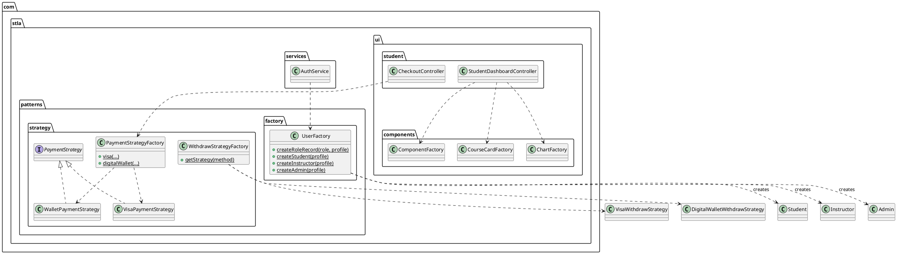
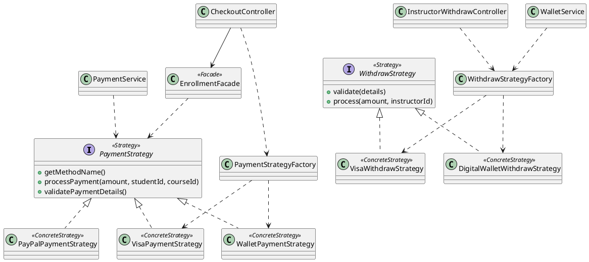
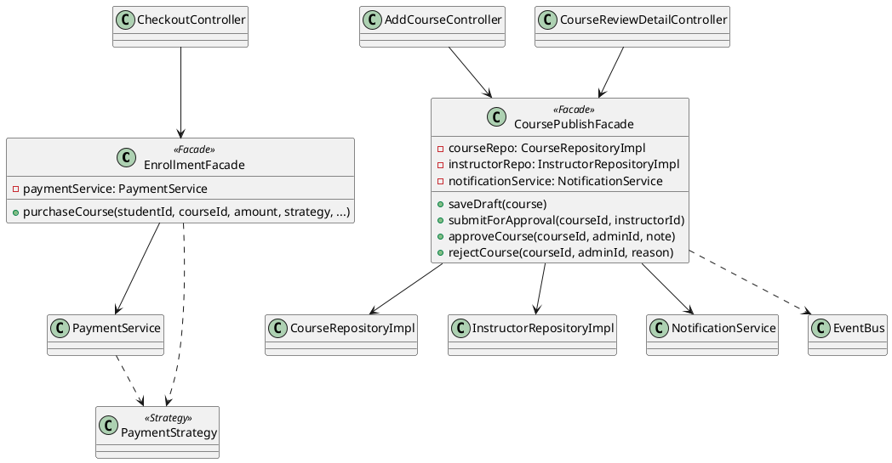
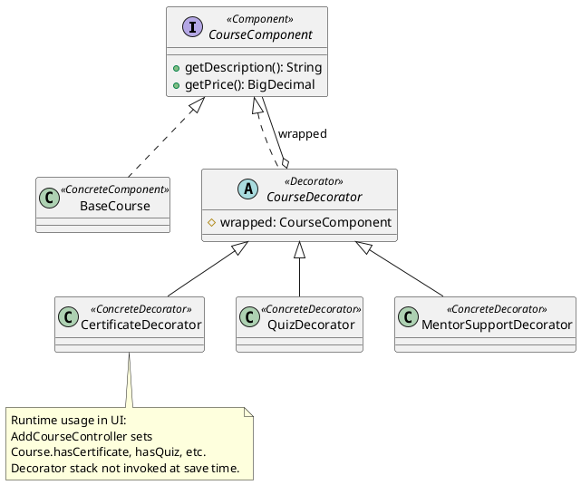
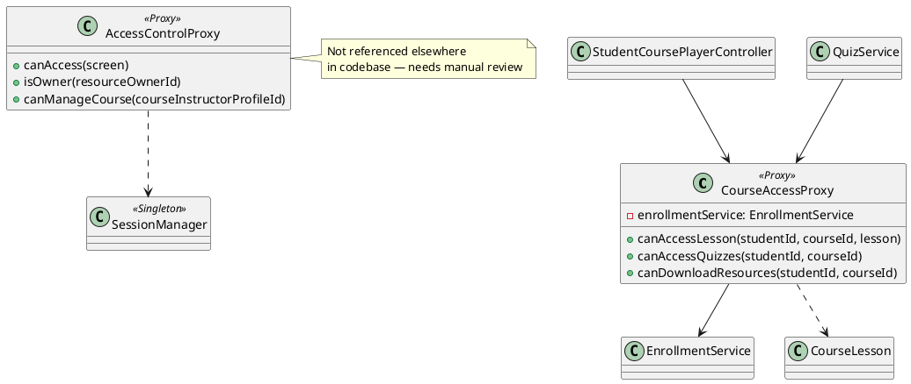
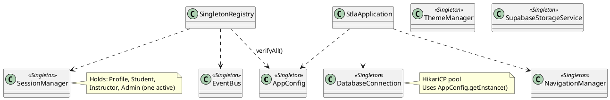
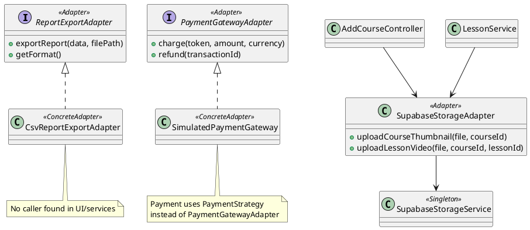

# STLA Desktop — Design Patterns UML

Detailed UML documentation for design patterns in the STLA JavaFX project. All class names are taken from the actual codebase under `src/main/java/com/stla`.

---

## Table of Contents

1. [Factory Pattern](#1-factory-pattern)
2. [Strategy Pattern](#2-strategy-pattern)
3. [Observer Pattern](#3-observer-pattern)
4. [Facade Pattern](#4-facade-pattern)
5. [Decorator Pattern](#5-decorator-pattern)
6. [Proxy Pattern](#6-proxy-pattern)
7. [Singleton Pattern](#7-singleton-pattern)
8. [Adapter Pattern](#8-adapter-pattern)

---

## 1. Factory Pattern

### Definition

The **Factory** pattern centralizes object creation behind a factory method or factory class so callers do not depend on concrete constructors.

### Why Used in STLA

- Create **role-specific records** (Student, Instructor, Admin) after registration
- Instantiate **payment/withdraw strategies** without exposing concrete class names to UI
- Build **reusable JavaFX UI nodes** (cards, charts, empty states) consistently

### Classes Found

| Class | Package | Type |
|-------|---------|------|
| `UserFactory` | `com.stla.patterns.factory` | Pattern factory |
| `PaymentStrategyFactory` | `com.stla.patterns.strategy` | Strategy factory |
| `WithdrawStrategyFactory` | `com.stla.patterns.strategy` | Strategy factory |
| `ComponentFactory` | `com.stla.ui.components` | UI factory |
| `CourseCardFactory` | `com.stla.ui.components` | UI factory |
| `ChartFactory` | `com.stla.ui.components` | UI factory |

### Class Responsibilities

| Class | Responsibility |
|-------|----------------|
| `UserFactory` | Creates `Student`, `Instructor`, or `Admin` from `Profile` + `AppRole` |
| `PaymentStrategyFactory` | Builds `VisaPaymentStrategy` or `WalletPaymentStrategy` from form data |
| `WithdrawStrategyFactory` | Returns `VisaWithdrawStrategy` or `DigitalWalletWithdrawStrategy` by method key |
| `ComponentFactory` | Creates stat cards, badges, loading/empty states, dialogs, sidebar |
| `CourseCardFactory` | Loads `course-card.fxml` and binds `CourseCardController` |
| `ChartFactory` | Creates bar/area/pie chart `VBox` widgets for dashboards |

### UML Relationships

| Relationship | Arrow | Why |
|--------------|-------|-----|
| Factory creates Strategy | `PaymentStrategyFactory ..> VisaPaymentStrategy` | Dependency: factory instantiates concrete strategy in static method |
| Factory creates Strategy | `PaymentStrategyFactory ..> WalletPaymentStrategy` | Same |
| UI uses ComponentFactory | `StudentDashboardController ..> ComponentFactory` | Dependency: static factory methods called from controller |
| Auth uses UserFactory | `AuthService ..> UserFactory` | Dependency: creates role record on register |

**Why not inheritance?** Factories do not extend the products they create.

### PlantUML Diagram



### Where Used in System

| Location | Factory |
|----------|---------|
| `AuthService` | `UserFactory` (registration) |
| `CheckoutController` | `PaymentStrategyFactory` |
| `InstructorWithdrawController`, `WalletService` | `WithdrawStrategyFactory` |
| All dashboards | `ComponentFactory`, `ChartFactory` |
| Catalog / student home | `CourseCardFactory` |

---

## 2. Strategy Pattern

### Definition

The **Strategy** pattern defines a family of algorithms (interfaces), encapsulates each one, and makes them interchangeable at runtime.

### Why Used in STLA

- Support **multiple payment methods** (Visa, digital wallet) at checkout without `if/else` in UI
- Support **multiple withdrawal methods** for instructor payouts
- Keep `EnrollmentFacade` and `PaymentService` independent of card/wallet details

### Classes Found

**Payment strategies:**

| Class | Package |
|-------|---------|
| `PaymentStrategy` | `com.stla.patterns.strategy` |
| `VisaPaymentStrategy` | `com.stla.patterns.strategy` |
| `WalletPaymentStrategy` | `com.stla.patterns.strategy` |
| `PayPalPaymentStrategy` | `com.stla.patterns.strategy` |
| `PaymentStrategyFactory` | `com.stla.patterns.strategy` |

**Withdraw strategies:**

| Class | Package |
|-------|---------|
| `WithdrawStrategy` | `com.stla.patterns.strategy` |
| `VisaWithdrawStrategy` | `com.stla.patterns.strategy` |
| `DigitalWalletWithdrawStrategy` | `com.stla.patterns.strategy` |
| `WithdrawStrategyFactory` | `com.stla.patterns.strategy` |

### Class Responsibilities

| Class | Responsibility |
|-------|----------------|
| `PaymentStrategy` | `validatePaymentDetails()`, `processPayment()`, `getMethodName()` |
| `VisaPaymentStrategy` | Validates card fields; simulates Visa charge |
| `WalletPaymentStrategy` | Validates wallet provider/id; simulates wallet charge |
| `PayPalPaymentStrategy` | PayPal email validation — **class exists, not in factory** |
| `WithdrawStrategy` | Validates/processes instructor withdrawal |
| `VisaWithdrawStrategy` | Bank card withdrawal path |
| `DigitalWalletWithdrawStrategy` | Digital wallet withdrawal path |

### UML Relationships

| Relationship | Arrow | Why |
|--------------|-------|-----|
| Strategy realization | `PaymentStrategy <\|.. VisaPaymentStrategy` | `implements` interface |
| Facade uses strategy | `EnrollmentFacade ..> PaymentStrategy` | Strategy passed as method parameter |
| Service uses strategy | `PaymentService ..> PaymentStrategy` | `processCoursePurchase(..., strategy, ...)` |

**Why not composition?** Strategy instance is passed per call, not always owned as field.

### PlantUML Diagram



### Where Used in System

| Screen / Flow | Classes |
|---------------|---------|
| Student checkout | `CheckoutController` → `PaymentStrategyFactory` → `EnrollmentFacade` |
| Payment persistence | `PaymentService.processCoursePurchase` |
| Instructor withdraw | `InstructorWithdrawController`, `WalletService` |

---

## 3. Observer Pattern

### Definition

The **Observer** pattern defines a one-to-many dependency: when one object (subject) changes state, all dependents (observers) are notified.

### Why Used in STLA

- Decouple **business events** (enrollment, payment, course approval) from **notification persistence**
- Allow multiple listeners per event type without tight coupling in services

### Classes Found

| Class | Package |
|-------|---------|
| `EventBus` | `com.stla.patterns.observer` |
| `EventListener` | `com.stla.patterns.observer` |
| `AppEvent` | `com.stla.patterns.observer` |
| `NotificationObserver` | `com.stla.patterns.observer` |

**Publishers (not observers, but subjects' clients):** `CourseService`, `PaymentService`, `CoursePublishFacade`, `QuizService`, `LearningProgressService`, `WalletService`, `AdminService`, `LessonService`, `CertificateService`, `ReviewService`, `AuthService`

### Class Responsibilities

| Class | Responsibility |
|-------|----------------|
| `EventBus` | Singleton registry: `subscribe`, `unsubscribe`, `publish` |
| `EventListener` | `onEvent(AppEvent)` callback interface |
| `AppEvent` | Record: `EventType`, `actorProfileId`, `targetId`, `message` |
| `NotificationObserver` | Subscribes to event types; delegates to `NotificationService.handleAppEvent` |

### UML Relationships

| Relationship | Arrow | Why |
|--------------|-------|-----|
| Observer realization | `EventListener <\|.. NotificationObserver` | Implements observer interface |
| Subject–Observer | `EventBus o-- EventListener` | Bus holds list of listeners per `EventType` |
| Publish dependency | `CourseService ..> EventBus` | Calls `publish` inside methods |
| Observer → service | `NotificationObserver --> NotificationService` | Persists notifications |

### PlantUML Diagram

```plantuml
@startuml STLA_Observer_Pattern
class EventBus <<Subject>> {
  - {static} INSTANCE
  - listeners: Map<EventType, List<EventListener>>
  +getInstance()
  +subscribe(type, listener)
  +publish(event)
}

interface EventListener <<Observer>> {
  +onEvent(event)
}

class NotificationObserver <<ConcreteObserver>> {
  +register()
  +onEvent(event)
}

record AppEvent {
  EventType type
  String actorProfileId
  String targetId
  String message
}

class NotificationService
class CourseService
class PaymentService
class CoursePublishFacade

EventListener <|.. NotificationObserver
EventBus o-- EventListener
EventBus ..> AppEvent

NotificationObserver --> NotificationService
CourseService ..> EventBus
PaymentService ..> EventBus
CoursePublishFacade ..> EventBus
NotificationObserver ..> EventBus : register()
@enduml
```

### Where Used in System

| Flow | Event examples |
|------|----------------|
| Enrollment | `ENROLLMENT_CREATED` |
| Payment | `PAYMENT_COMPLETED`, `PAYMENT_FAILED` |
| Course lifecycle | `COURSE_SUBMITTED`, `COURSE_APPROVED`, `COURSE_REJECTED` |
| Learning | `LESSON_COMPLETED`, `COURSE_COMPLETED`, `CERTIFICATE_ISSUED` |
| Quizzes | `QUIZ_SUBMITTED`, `QUIZ_PASSED`, `QUIZ_FAILED` |

Registration: `NotificationObserver.register()` (typically at app startup via `AuthService`).

---

## 4. Facade Pattern

### Definition

The **Facade** provides a simplified interface to a complex subsystem of classes (services, repositories, strategies).

### Why Used in STLA

- **Enrollment/checkout:** one call for payment validation + DB enrollment + wallet split + notifications
- **Course publishing:** one API for draft save, submit, approve, reject with verification and notifications

### Classes Found

| Class | Package |
|-------|---------|
| `EnrollmentFacade` | `com.stla.patterns.facade` |
| `CoursePublishFacade` | `com.stla.patterns.facade` |

### Class Responsibilities

| Class | Responsibility |
|-------|----------------|
| `EnrollmentFacade` | `purchaseCourse(...)`: validate strategy → process payment → delegate to `PaymentService` |
| `CoursePublishFacade` | `saveDraft`, `submitForApproval`, `approveCourse`, `rejectCourse` |

### UML Relationships

| Relationship | Arrow | Why |
|--------------|-------|-----|
| Facade → service | `EnrollmentFacade --> PaymentService` | Field / constructor injection |
| Facade ..> strategy | `EnrollmentFacade ..> PaymentStrategy` | Method parameter |
| Facade → repos | `CoursePublishFacade --> CourseRepositoryImpl` | Direct repository use |
| Facade → observer | `CoursePublishFacade ..> EventBus` | Publishes approval/rejection events |

**Why not inheritance?** Facade does not extend services.

### PlantUML Diagram



### Where Used in System

| UI | Facade |
|----|--------|
| `CheckoutController` | `EnrollmentFacade` |
| `AddCourseController` | `CoursePublishFacade` (draft + submit) |
| `CourseReviewDetailController` | `CoursePublishFacade` (approve/reject) |

---

## 5. Decorator Pattern

### Definition

The **Decorator** attaches additional responsibilities to an object dynamically by wrapping it with decorator objects that share a common component interface.

### Why Used in STLA

- Model **course add-ons** (certificate, quiz, mentor, resources) as layered price/description extensions
- Demonstrate GoF decorator structure for course pricing

### Classes Found

| Class | Package |
|-------|---------|
| `CourseComponent` | `com.stla.patterns.decorator` |
| `BaseCourse` | `com.stla.patterns.decorator` |
| `CourseDecorator` | `com.stla.patterns.decorator` |
| `CertificateDecorator` | `com.stla.patterns.decorator` |
| `QuizDecorator` | `com.stla.patterns.decorator` |
| `MentorSupportDecorator` | `com.stla.patterns.decorator` |

### Class Responsibilities

| Class | Responsibility |
|-------|----------------|
| `CourseComponent` | `getDescription()`, `getPrice()` |
| `BaseCourse` | Core title + base price |
| `CourseDecorator` | Abstract wrapper holding `CourseComponent wrapped` |
| `CertificateDecorator` | Adds “+ Certificate” and +$10 |
| `QuizDecorator` | Adds quiz addon to description/price |
| `MentorSupportDecorator` | Adds mentor addon |

### UML Relationships

| Relationship | Arrow | Why |
|--------------|-------|-----|
| Realization | `CourseComponent <\|.. BaseCourse` | Base implements component |
| Realization | `CourseComponent <\|.. CourseDecorator` | Decorator implements same interface |
| Aggregation | `CourseDecorator o-- CourseComponent` | Wraps inner component |
| Generalization | `CourseDecorator <\|-- CertificateDecorator` | Concrete decorator extends abstract |

### PlantUML Diagram



### Where Used in System

| Location | Usage |
|----------|-------|
| `patterns.decorator` | Full pattern implementation |
| `AddCourseController` | UI toggles map to `Course.setHasCertificate()` / `setHasQuiz()` — **domain flags, not decorator stack** |

**Manual review:** Decorator classes are educational/structural; production save path uses `Course` boolean columns.

---

## 6. Proxy Pattern

### Definition

The **Proxy** provides a surrogate or placeholder to control access to another object.

### Why Used in STLA

- **Course access:** gate lessons/quizzes/resources by enrollment and preview flag without duplicating checks in every controller method
- **Access control (planned):** role-based screen paths

### Classes Found

| Class | Package |
|-------|---------|
| `CourseAccessProxy` | `com.stla.patterns.proxy` |
| `AccessControlProxy` | `com.stla.patterns.proxy` |

### Class Responsibilities

| Class | Responsibility |
|-------|----------------|
| `CourseAccessProxy` | `canAccessLesson`, `canAccessQuizzes`, `canDownloadResources`; uses `EnrollmentService` |
| `AccessControlProxy` | `canAccess(screen)`, `isOwner`, `canManageCourse`; uses `SessionManager` |

### UML Relationships

| Relationship | Arrow | Why |
|--------------|-------|-----|
| Proxy → service | `CourseAccessProxy --> EnrollmentService` | Field: delegates enrollment check |
| Proxy → model | `CourseAccessProxy ..> CourseLesson` | Lesson parameter in method |
| UI → proxy | `StudentCoursePlayerController --> CourseAccessProxy` | Controller owns proxy instance |

**Why not realization?** `CourseAccessProxy` does not implement a separate subject interface in code.

### PlantUML Diagram



### Where Used in System

| Screen | Proxy |
|--------|-------|
| `StudentCoursePlayerController` | `CourseAccessProxy` (lesson lock overlay) |
| `QuizService` | `CourseAccessProxy` (quiz access) |

---

## 7. Singleton Pattern

### Definition

**Singleton** ensures a class has only one instance and provides a global access point (`getInstance()`).

### Why Used in STLA

- Single **DB connection pool**, **app config**, **user session**, **event bus**, **navigation** state for JavaFX desktop app

### Classes Found

| Class | Package | Initialization |
|-------|---------|----------------|
| `AppConfig` | `com.stla.app` | Double-checked locking |
| `DatabaseConnection` | `com.stla.core.database` | Double-checked locking |
| `SessionManager` | `com.stla.core.session` | Double-checked locking |
| `NavigationManager` | `com.stla.core.navigation` | Eager static instance |
| `EventBus` | `com.stla.patterns.observer` | Eager `INSTANCE` |
| `ThemeManager` | `com.stla.ui.components` | Lazy on first `getInstance()` |
| `SupabaseStorageService` | `com.stla.services` | Static `getInstance()` |
| `SingletonRegistry` | `com.stla.patterns.singleton` | Documentation/verification only |

### PlantUML Diagram



### Where Used in System

Entire application — every controller/service/repository accesses `SessionManager` or `DatabaseConnection` for auth and SQL.

---

## 8. Adapter Pattern

### Definition

The **Adapter** converts the interface of a class into another interface clients expect — wrapping legacy or external APIs.

### Why Used in STLA

- **Report export:** uniform `exportReport(data, path)` for CSV (and future formats)
- **Payment gateway:** unified `charge` / `refund` over simulated provider
- **Storage:** `SupabaseStorageAdapter` wraps `SupabaseStorageService` for course-specific paths/validation

### Classes Found

| Class | Package |
|-------|---------|
| `ReportExportAdapter` | `com.stla.patterns.adapter` |
| `CsvReportExportAdapter` | `com.stla.patterns.adapter` |
| `PaymentGatewayAdapter` | `com.stla.patterns.adapter` |
| `SimulatedPaymentGateway` | `com.stla.patterns.adapter` |
| `SupabaseStorageAdapter` | `com.stla.services` |

### Class Responsibilities

| Class | Responsibility |
|-------|----------------|
| `ReportExportAdapter` | `exportReport`, `getFormat` |
| `CsvReportExportAdapter` | Writes CSV file from row data |
| `PaymentGatewayAdapter` | `charge`, `refund`, `getProviderName` |
| `SimulatedPaymentGateway` | Simulated gateway responses |
| `SupabaseStorageAdapter` | Upload thumbnails, videos, resources to Supabase buckets |

### UML Relationships

| Relationship | Arrow | Why |
|--------------|-------|-----|
| Realization | `ReportExportAdapter <\|.. CsvReportExportAdapter` | Implements adapter interface |
| Realization | `PaymentGatewayAdapter <\|.. SimulatedPaymentGateway` | Implements gateway interface |
| Adapter → adaptee | `SupabaseStorageAdapter --> SupabaseStorageService` | Wraps storage service |

### PlantUML Diagram



### Where Used in System

| Adapter | Used? |
|---------|-------|
| `SupabaseStorageAdapter` | ✅ `AddCourseController`, `LessonService`, `ResourceService`, `QuestionService` |
| `CsvReportExportAdapter` | ❌ Not found in callers |
| `SimulatedPaymentGateway` | ❌ Not found in callers |

---

## Pattern Cross-Reference Table

| Pattern | Key Entry Point | Collaborators |
|---------|-----------------|---------------|
| Factory | `PaymentStrategyFactory.visa()` | All `*Strategy`, `UserFactory`, UI factories |
| Strategy | `PaymentStrategy.processPayment()` | `EnrollmentFacade`, `PaymentService` |
| Observer | `EventBus.publish()` | All `*Service` publishers, `NotificationObserver` |
| Facade | `EnrollmentFacade.purchaseCourse()` | `PaymentService`, strategies |
| Decorator | `CourseComponent.getPrice()` | Decorator chain (pattern package only) |
| Proxy | `CourseAccessProxy.canAccessLesson()` | `EnrollmentService`, student player |
| Singleton | `*.getInstance()` | Entire app |
| Adapter | `SupabaseStorageAdapter.upload*` | `SupabaseStorageService` |

---

*See [uml-index.md](./uml-index.md) for summary and [full-project-uml.md](./full-project-uml.md) for full architecture.*
