# STLA Desktop — Full Project UML & Architecture

Complete architecture documentation for the STLA JavaFX Desktop application (`com.stla`).

---

## Table of Contents

1. [Package Structure](#1-package-structure)
2. [Clean Architecture Flow](#2-clean-architecture-flow)
3. [Layer Diagram (PlantUML)](#3-layer-diagram-plantuml)
4. [Domain Model UML](#4-domain-model-uml)
5. [Repository Layer](#5-repository-layer)
6. [Service Layer](#6-service-layer)
7. [UI Layer](#7-ui-layer)
8. [Core & Application](#8-core--application)
9. [Key User Flows](#9-key-user-flows)
10. [Resources (FXML/CSS)](#10-resources-fxmlcss)

---

## 1. Package Structure

```
com.stla
├── app/                    # Application entry, config
│   ├── Launcher.java
│   ├── StlaApplication.java
│   └── AppConfig.java
├── core/                   # Cross-cutting infrastructure
│   ├── database/
│   │   └── DatabaseConnection.java
│   ├── navigation/
│   │   ├── NavigationManager.java
│   │   └── StudentNavigationContext.java
│   └── session/
│       └── SessionManager.java
├── domain/                 # Business models & repository contracts
│   ├── enums/              # AppRole, CourseStatus, PaymentStatus, ...
│   ├── interfaces/         # CourseRepository, ProfileRepository, ...
│   └── models/             # Course, Student, Quiz, Enrollment, ...
├── data/                   # Persistence implementations
│   ├── mappers/
│   │   └── ResultSetMapper.java
│   └── repositories/       # *RepositoryImpl, *Repository (concrete)
├── patterns/               # GoF patterns (explicit package)
│   ├── adapter/
│   ├── decorator/
│   ├── facade/
│   ├── factory/
│   ├── observer/
│   ├── proxy/
│   ├── singleton/
│   └── strategy/
├── services/               # Application / use-case services
│   ├── AuthService.java
│   ├── CourseService.java
│   ├── PaymentService.java
│   └── ... (22 service classes)
└── ui/                     # JavaFX controllers & components
    ├── admin/              # Admin dashboard & management
    ├── auth/               # Login, register
    ├── instructor/         # Instructor dashboard & course tools
    ├── student/            # Student learning & checkout
    └── components/         # Reusable UI widgets
```

**Resources (not Java packages):**

```
src/main/resources/com/stla/
├── views/          # FXML screens (admin, auth, instructor, student, components)
├── css/            # Stylesheets
└── images/         # Static assets (if present)
```

---

## 2. Clean Architecture Flow

STLA follows a **layered desktop architecture** (not strict DDD, but similar separation):

```
┌─────────────────────────────────────────────────────────────┐
│  UI (FXML + Controllers + Components)                        │
│  - Binds user actions, shows data                            │
└───────────────────────────┬─────────────────────────────────┘
                            │ calls
                            ▼
┌─────────────────────────────────────────────────────────────┐
│  Services (use cases)                                        │
│  - Business rules, orchestration, EventBus publish           │
└───────────────────────────┬─────────────────────────────────┘
                            │ uses
                            ▼
┌─────────────────────────────────────────────────────────────┐
│  Repositories (data access)                                  │
│  - JDBC SQL via DatabaseConnection                           │
└───────────────────────────┬─────────────────────────────────┘
                            │ maps rows to
                            ▼
┌─────────────────────────────────────────────────────────────┐
│  Domain Models + Enums                                       │
└─────────────────────────────────────────────────────────────┘

        Patterns (facade, strategy, observer) sit between UI and services
```

| Layer | Depends On | Must Not Depend On |
|-------|------------|-------------------|
| `ui` | `services`, `domain`, `patterns`, `core` | FXML should not contain SQL |
| `services` | `domain`, `data`, `patterns`, `core` | JavaFX nodes |
| `data` | `domain`, `core` | `ui` |
| `domain` | (minimal) enums only | `ui`, `data`, JavaFX |

---

## 3. Layer Diagram (PlantUML)

```plantuml
@startuml STLA_Layered_Architecture
skinparam packageStyle rectangle

package "com.stla.ui" {
  class StudentDashboardController
  class CheckoutController
  class AddCourseController
  class AdminDashboardController
  class ComponentFactory
}

package "com.stla.patterns" {
  class EnrollmentFacade <<Facade>>
  class CoursePublishFacade <<Facade>>
  class EventBus <<Singleton>>
  class PaymentStrategy <<Strategy>>
  class CourseAccessProxy <<Proxy>>
}

package "com.stla.services" {
  class AuthService
  class CourseService
  class PaymentService
  class LessonService
  class NotificationService
}

package "com.stla.data.repositories" {
  class CourseRepositoryImpl
  class EnrollmentRepository
  class ProfileRepositoryImpl
}

package "com.stla.domain" {
  interface CourseRepository
  class Course
  class Enrollment
  class Profile
}

package "com.stla.core" {
  class SessionManager <<Singleton>>
  class NavigationManager <<Singleton>>
  class DatabaseConnection <<Singleton>>
}

package "com.stla.app" {
  class AppConfig <<Singleton>>
  class StlaApplication
}

' UI to patterns & services
CheckoutController --> EnrollmentFacade
CheckoutController --> CourseDetailsService
AddCourseController --> CoursePublishFacade
StudentDashboardController --> CourseService
AdminDashboardController --> DashboardService

' Facades to services
EnrollmentFacade --> PaymentService
CoursePublishFacade --> NotificationService

' Services to repos & domain
CourseService --> CourseRepositoryImpl
PaymentService --> EnrollmentRepository
AuthService --> ProfileRepositoryImpl
AuthService ..> EventBus

' Repository realization
CourseRepository <|.. CourseRepositoryImpl
ProfileRepository <|.. ProfileRepositoryImpl

' Repos to DB
CourseRepositoryImpl --> DatabaseConnection
EnrollmentRepository --> DatabaseConnection

' Core
DatabaseConnection ..> AppConfig
SessionManager --> Profile
SessionManager --> Student
NavigationManager ..> StlaApplication

' FXML dependency
rectangle "FXML Views" #lightgray
FXML_Views ..> StudentDashboardController : fx:controller
FXML_Views ..> CheckoutController

@enduml
```

### Relationship Reasoning (Architecture)

| From | To | Arrow | Why |
|------|-----|-------|-----|
| `Controller` | `Service` | `-->` | Controller calls service methods |
| `Service` | `RepositoryImpl` | `-->` | Service owns or instantiates repository |
| `RepositoryImpl` | `Repository` | `<\|..` | Implements domain interface (where exists) |
| `RepositoryImpl` | `DatabaseConnection` | `-->` | Gets JDBC `Connection` |
| `FXML` | `Controller` | `..>` | FXML `fx:controller` loads controller at runtime |
| `Facade` | `Service` | `-->` | Facade coordinates subsystem |
| `SessionManager` | `Profile` | `-->` | Holds current user state |

---

## 4. Domain Model UML

### 4.1 Profile & Roles

**No inheritance** between `Profile` and role entities. Association via `profileId`.

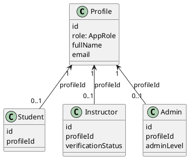

### 4.2 Course Content Hierarchy

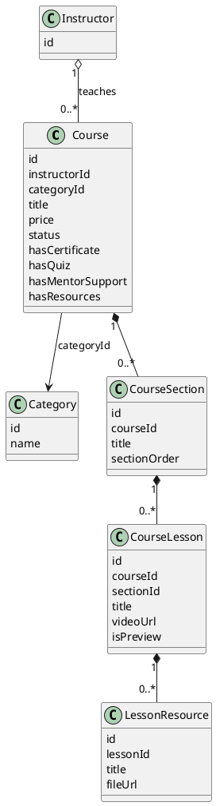

| Relationship | Type | Reason |
|--------------|------|--------|
| Instructor → Course | Aggregation `o--` | Courses are separate entities with own lifecycle |
| Course → Category | Association `-->` | FK `categoryId` |
| Course → Section → Lesson | Composition `*--` | Containment hierarchy |

### 4.3 Quiz Model

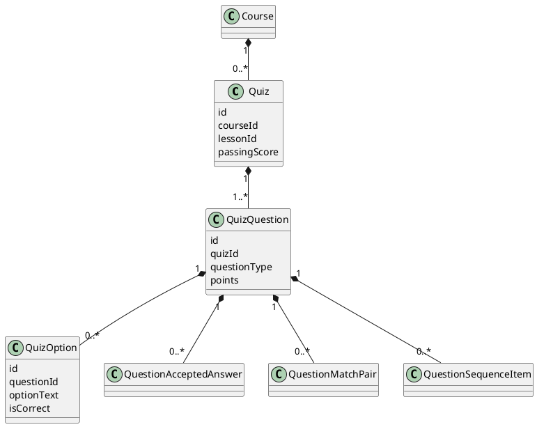

### 4.4 Enrollment & Progress

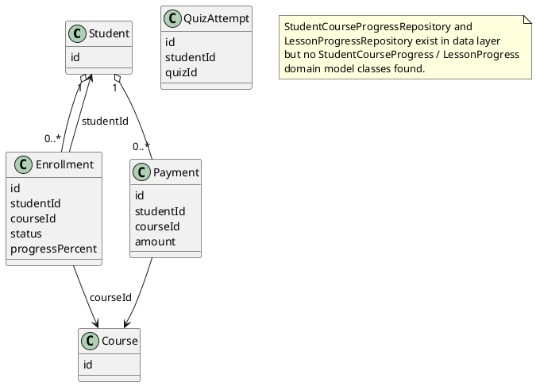

### 4.5 Wallet & Admin

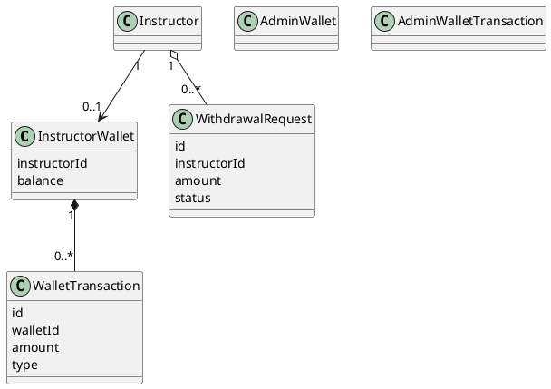

### 4.6 Other Domain Models

| Model | Package | Purpose |
|-------|---------|---------|
| `Notification` | `domain.models` | In-app notifications |
| `Review` | `domain.models` | Student course reviews |
| `CourseReview` | `domain.models` | Course review display DTO |
| `CourseDetailsView` | `domain.models` | Aggregated details for catalog page |
| `IssuedCertificate` | `domain.models` | Completion certificates |
| `ActivityLog` | `domain.models` | Admin activity |
| `ChartSeries` | `domain.models` | Dashboard chart data |

---

## 5. Repository Layer

### 5.1 Interface vs Concrete Repositories

| Interface (`domain.interfaces`) | Implementation (`data.repositories`) |
|-----------------------------------|--------------------------------------|
| `CourseRepository` | `CourseRepositoryImpl` |
| `ProfileRepository` | `ProfileRepositoryImpl` |
| `StudentRepository` | `StudentRepositoryImpl` |
| `InstructorRepository` | `InstructorRepositoryImpl` |
| `AdminRepository` | `AdminRepositoryImpl` |
| `CategoryRepository` | `CategoryRepositoryImpl` |
| `NotificationRepository` | `NotificationRepositoryImpl` |

**Concrete-only (no interface in `domain.interfaces`):**

| Repository | Used By |
|------------|---------|
| `EnrollmentRepository` | `PaymentService`, `EnrollmentService`, `CourseService` |
| `PaymentRepository` | `PaymentService` |
| `WalletRepository` | `PaymentService`, `WalletService` |
| `SectionRepositoryImpl` | `LessonService` |
| `LessonRepositoryImpl` | `LessonService` |
| `ResourceRepositoryImpl` | `ResourceService` |
| `QuizRepositoryImpl` | `QuizService` |
| `QuizAttemptRepositoryImpl` | `QuizService` |
| `QuestionRepositoryImpl` | `QuestionService` |
| `StudentCourseProgressRepository` | `LearningProgressService` |
| `LessonProgressRepository` | `LearningProgressService` |

### 5.2 Repository UML

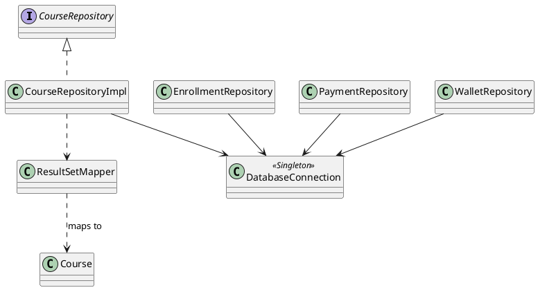

---

## 6. Service Layer

| Service | Primary Responsibility |
|---------|------------------------|
| `AuthService` | Login, register, session, `UserFactory`, `EventBus` |
| `CourseService` | Catalog, enrollments, instructor courses |
| `CourseDetailsService` | Course detail page aggregation |
| `PaymentService` | Purchase transaction, wallet split, events |
| `EnrollmentService` | Enrollment checks |
| `LessonService` | Sections, lessons, uploads |
| `QuizService` | Quiz CRUD, attempts, access proxy |
| `QuestionService` | Question editor persistence |
| `LearningProgressService` | Lesson/course progress |
| `CertificateService` | Issue certificates |
| `NotificationService` | CRUD notifications, `handleAppEvent` |
| `ProfileService` | Profile/avatar updates |
| `WalletService` | Instructor wallet, withdrawals |
| `ReviewService` | Student reviews |
| `AdminService` | Admin operations, verification events |
| `DashboardService` | Admin/instructor dashboard stats |
| `InstructorService` | Instructor profile, verification |
| `ResourceService` | Lesson resources |
| `ResourceDownloadService` | Signed download URLs |
| `SupabaseStorageService` | Low-level Supabase REST uploads |
| `SupabaseStorageAdapter` | Course-scoped upload adapter |
| `CountryPhoneLoader` | Phone country data |

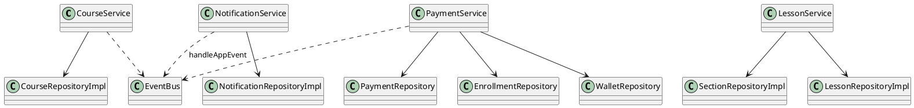

---

## 7. UI Layer

### 7.1 Role-Based Controllers

| Role | Dashboard | Key Screens |
|------|-----------|-------------|
| **Student** | `StudentDashboardController` | Catalog, checkout, course player, quizzes, certificates, reviews |
| **Instructor** | `InstructorDashboardController` | My courses, add course, course player, quiz builder, wallet, withdraw |
| **Admin** | `AdminDashboardController` | Users, courses, course review, payments, wallet, verifications |

### 7.2 Navigation Model

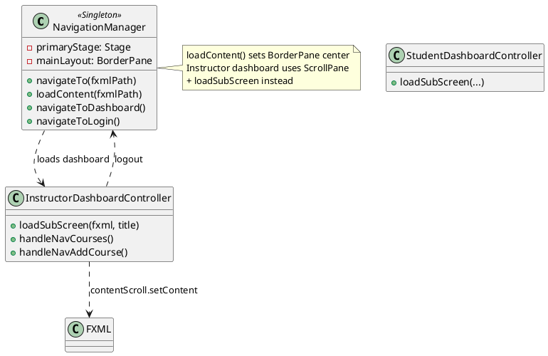

### 7.3 UI → Service Map (Sample)

| Controller | Services / Facades |
|------------|-------------------|
| `LoginController` | `AuthService` |
| `CheckoutController` | `EnrollmentFacade`, `CourseDetailsService` |
| `AddCourseController` | `CoursePublishFacade`, `SupabaseStorageAdapter` |
| `StudentCoursePlayerController` | `LessonService`, `LearningProgressService`, `CourseAccessProxy` |
| `CourseReviewDetailController` | `CoursePublishFacade`, `LessonService` |
| `AdminDashboardController` | `DashboardService` |

---

## 8. Core & Application

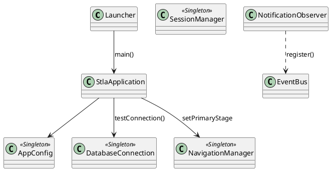

| Class | Role |
|-------|------|
| `Launcher` | Java main entry → launches JavaFX |
| `StlaApplication` | `Application` subclass; loads login; registers observer |
| `AppConfig` | `.env` / DB / Supabase settings |
| `DatabaseConnection` | HikariCP pool to Supabase PostgreSQL |
| `SessionManager` | Current user session (profile + role entity) |
| `NavigationManager` | Scene switching, CSS loading, `ThemeManager` hook |

---

## 9. Key User Flows

### 9.1 Student Purchase Flow

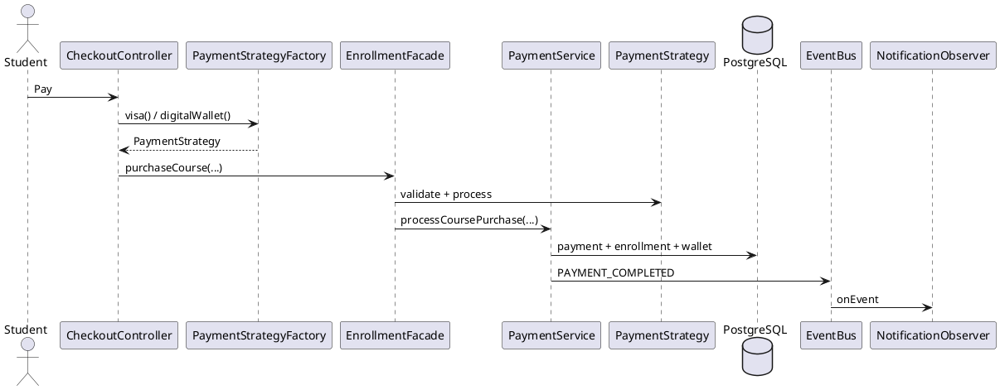

### 9.2 Instructor Course Submit Flow

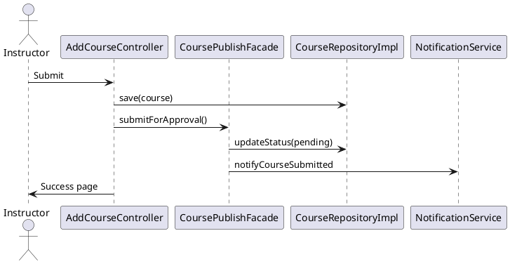

### 9.3 Admin Course Approval Flow

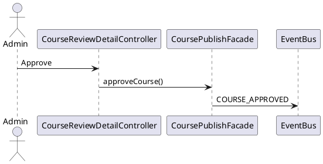

---

## 10. Resources (FXML/CSS)

| Path | Role |
|------|------|
| `views/auth/login.fxml` | Login screen |
| `views/student/student-dashboard.fxml` | Student shell |
| `views/instructor/instructor-dashboard.fxml` | Instructor shell |
| `views/admin/admin-dashboard.fxml` | Admin shell |
| `views/instructor/add-course.fxml` | Course wizard |
| `views/components/course-card.fxml` | Catalog card component |

**Relationship:** FXML `..>` Controller (dependency at load time via `fx:controller` attribute).

---

## Architecture Summary Table

| Concern | Implementation |
|---------|----------------|
| UI framework | JavaFX 25 + FXML |
| Database | PostgreSQL (Supabase) via JDBC + HikariCP |
| File storage | Supabase Storage REST API |
| Auth session | `SessionManager` singleton |
| Cross-cutting events | `EventBus` + `NotificationObserver` |
| Payment abstraction | Strategy + `EnrollmentFacade` |
| Course addons (pattern) | Decorator classes; DB flags on `Course` |
| Access control | `CourseAccessProxy` |

---

## Items Needing Manual Review

1. **Repository interface coverage** — many repos lack `domain.interfaces` counterparts.
2. **Decorator vs `Course` flags** — two parallel representations of add-ons.
3. **`AccessControlProxy`** — implemented but unused.
4. **`PaymentGatewayAdapter`** — not used; payment goes through `PaymentStrategy`.
5. **Progress entities** — progress tracked in SQL via repositories without dedicated domain classes.

---

*Index: [uml-index.md](./uml-index.md) | Patterns: [design-patterns-uml.md](./design-patterns-uml.md) | Arrows: [uml-relationships-guide.md](./uml-relationships-guide.md)*
